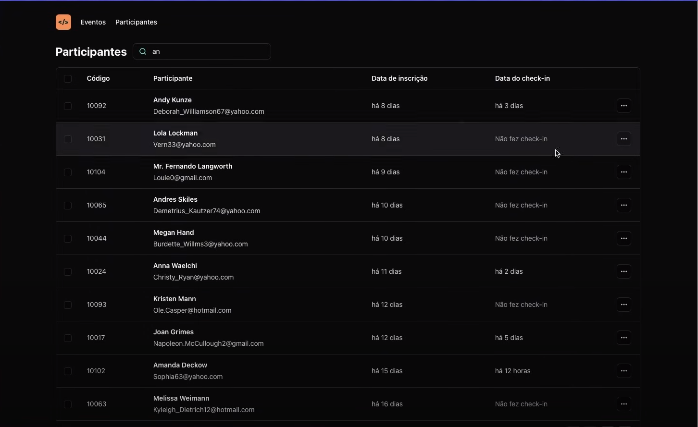
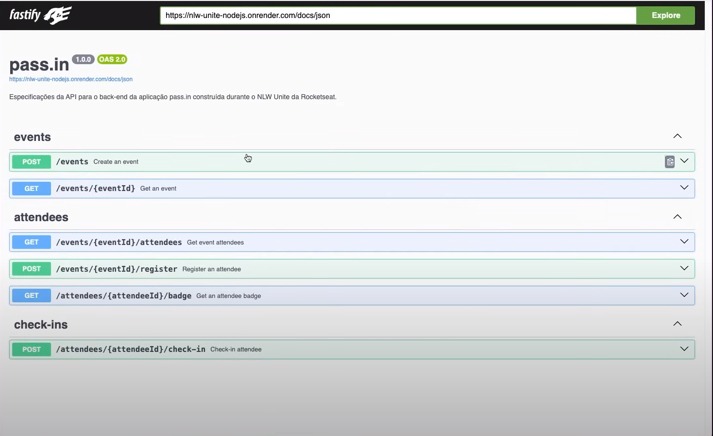

# Pass.in - Participant Management for In-Person Events 🖥️

Pass.in is a modern and efficient solution for managing participants in in-person events, developed during Rocketseat's NLW Unite immersion week. This project aims to facilitate event organization, allowing for stricter and simplified participant control, in addition to offering a more pleasant experience for users.

## Technologies Used 🚀

This project is a robust example of a full-stack application, implemented with a variety of modern technologies:

- **Backend:** Developed in two different stacks, Python and Node.js, to demonstrate flexibility and versatility in backend services construction.
- **Frontend:** Uses React to create a dynamic and responsive user interface.
- **DevOps:** Employs Docker, ArgoCD, Kubernetes, GitHub Actions, and Terraform for CI/CD pipeline automation, container orchestration, and infrastructure as code management, ensuring efficient and continuous delivery.

## Features

- **Participant Management:** Registration, updating, and removal of event participants.
- **Access Control:** Management of participant access to events, ensuring organization and security.
- **User-Friendly Interface:** An intuitive and easy-to-navigate user interface, developed with React.

## Application Photos 🖥️

### Frontend

### Backend

